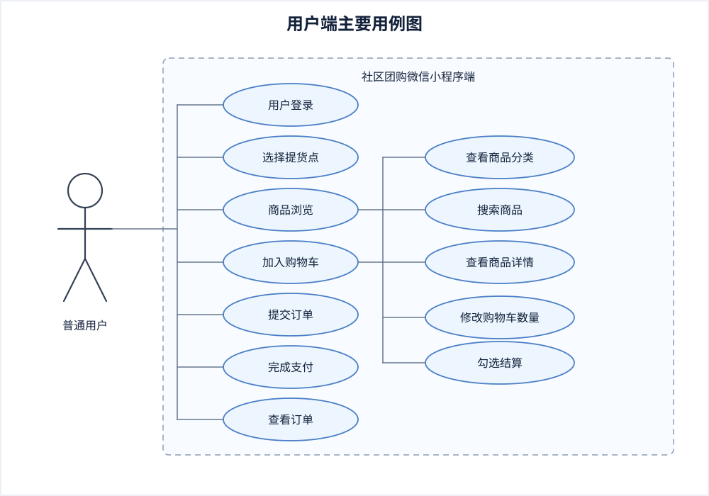
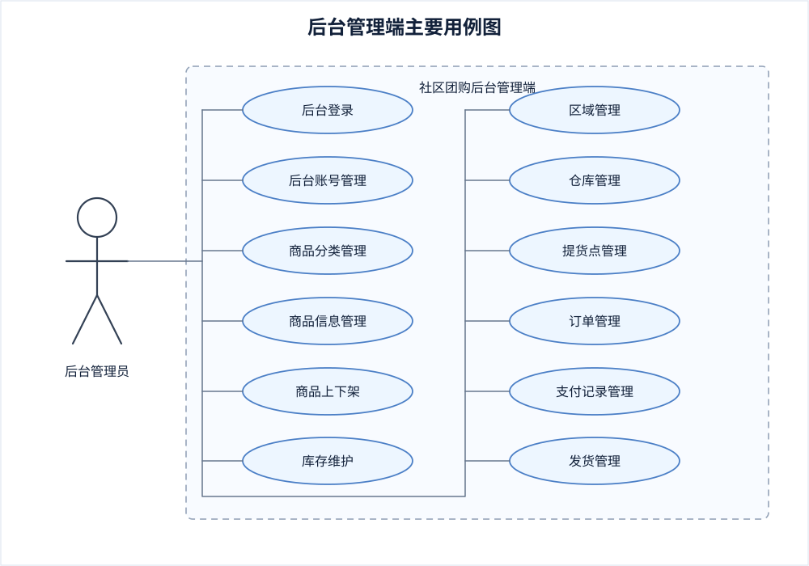
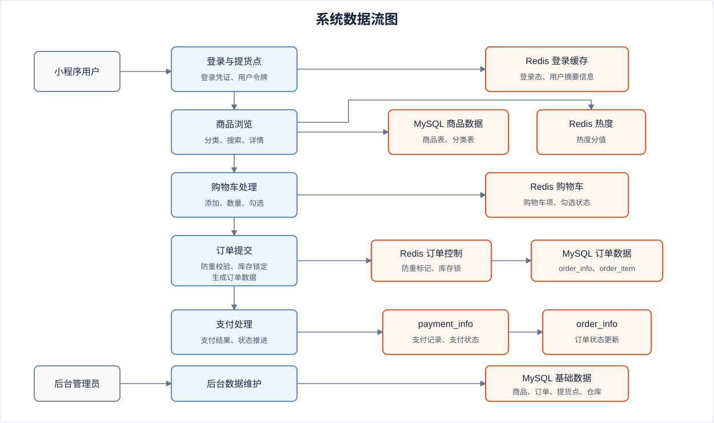
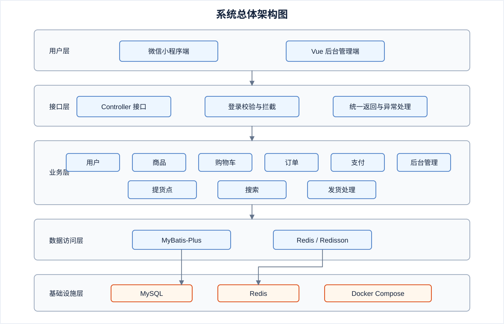
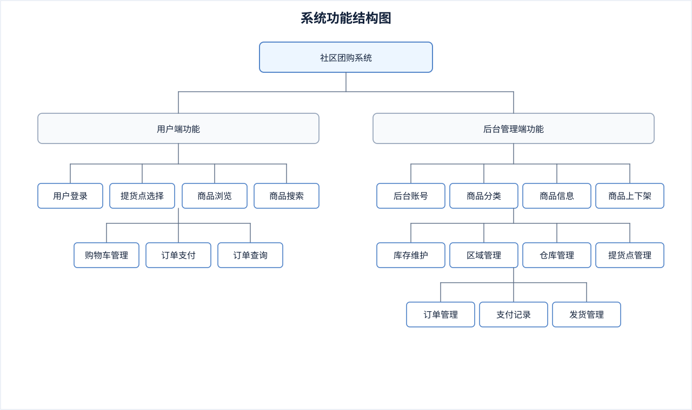
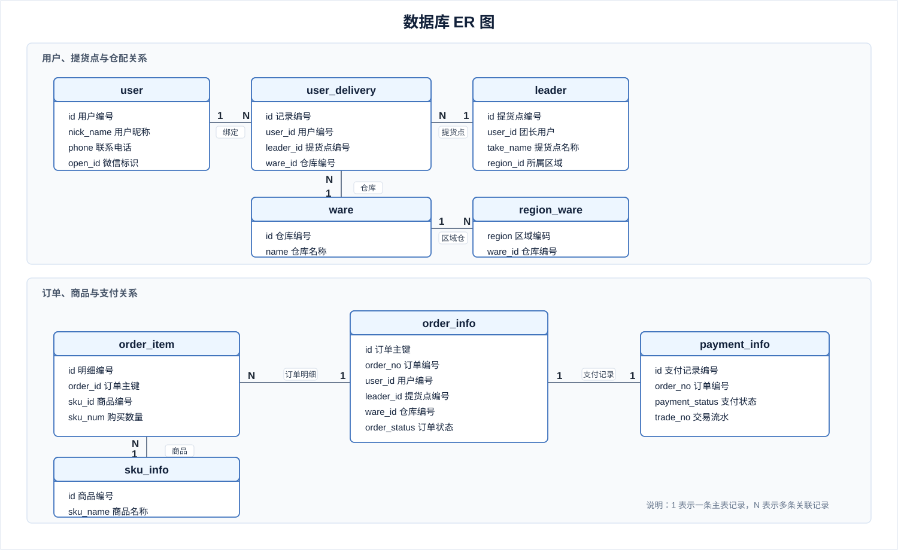

基于Spring Boot的社区团购系统设计与实现

摘  要

社区团购把线上下单和线下自提结合在一起，适合生鲜、粮油、日用品等日常消费场景。围绕这一业务流程，本文设计并实现了一套基于 Spring Boot 的社区团购系统。系统分为微信小程序端和后台管理端，小程序端提供用户登录、提货点选择、商品浏览、购物车、订单提交、支付和订单查询等功能，后台管理端用于维护商品、订单、提货点、区域仓库和发货数据。

系统后端采用 Spring Boot 和 MyBatis-Plus 进行开发，使用 MySQL 保存用户、商品、订单和支付等业务数据，使用 Redis 处理登录状态、购物车数据和商品热度等临时数据。订单提交时，系统通过 Redis 与 Lua 脚本进行防重校验；库存处理时，使用 Redisson 分布式锁控制并发修改。前端部分包括 Vue 后台管理端和 uni-app 小程序端，分别完成后台数据维护和用户购物操作。

经本地测试，系统可以完成从登录、浏览商品、加入购物车到提交订单、模拟支付和订单查询的流程，后台也可以完成商品维护、订单查看和发货处理。测试过程中，购物车数据、订单状态和支付记录能够随操作正常变化，系统基本达到本课题的设计要求。

关键词：Spring Boot；社区团购；Redis；购物车；订单管理

ABSTRACT

Community group buying combines online ordering with offline pickup and is often used for daily goods such as fresh food, groceries, and household products. Based on this business flow, this paper designs and implements a community group buying system using Spring Boot. The system consists of a WeChat Mini Program and a back-office management system. The Mini Program provides login, pickup point selection, product browsing, shopping cart, order submission, payment, and order query functions. The management system is used to maintain products, orders, pickup points, regional warehouses, and delivery data.

The backend is developed with Spring Boot and MyBatis-Plus. MySQL stores business data such as users, products, orders, and payment records, while Redis is used for login state, shopping cart data, and product hot scores. During order submission, Redis and Lua scripts are used to avoid repeated submissions. Redisson distributed locks are used during inventory processing to reduce concurrent stock update problems. The frontend includes a Vue management system and a uni-app Mini Program.

Local tests show that the system can complete the process from login, product browsing, and shopping cart operation to order submission, simulated payment, and order query. The back-office system can also handle product maintenance, order viewing, and delivery processing. During testing, shopping cart data, order status, and payment records changed normally with user operations, so the system basically meets the design requirements of this project.

Key Words: Spring Boot; Community Group Buying; Redis; Shopping Cart; Order Management

第1章 绪论

1.1 课题背景及意义

随着移动互联网的不断发展，线上购物已经成为居民日常消费当中比较常见的方式。社区团购是在这一背景下形成的一种本地零售模式。用户可以借助小程序浏览商品、提交订单并完成支付，平台再依据订单进行统一分拣以及配送，最后由用户到指定提货点自提。相比传统电商直接配送到家的方式，社区团购更加依赖提货点以及社区范围内的统一履约，在生鲜、水果、蔬菜以及日用快消品等场景中应用较多。

社区团购虽然属于电商业务的一种，但在系统设计上不能只考虑商品展示以及订单查询。用户在下单前需要选择提货点，提交订单时需要去处理购物车、订单金额以及库存信息，支付完成后还需要更新订单状态并衔接后续提货流程。如果这些环节之间缺少有效联系，就会影响用户的购买体验，也会给后台管理带来不便。因此，围绕该场景设计系统，可以进一步梳理移动端下单、库存处理和后台维护之间的业务关系。

用户使用该系统后，可以在手机端完成商品浏览、加入购物车、提交订单和支付等操作，线下选购和排队等待的时间会相应减少。后台管理人员则可以集中维护商品、库存、订单和提货点等信息，及时查看业务数据并进行处理。

本课题围绕社区团购业务，选用 Spring Boot、MyBatis-Plus、MySQL、Redis、JWT、Redisson 和 Docker 等技术，设计并实现一套社区团购系统。系统主要包含用户登录、商品浏览、购物车管理、订单提交、支付处理以及后台商品和订单管理等功能。借助本课题的设计与实现，可以对社区团购业务流程进行分析，并完成从需求分析、系统设计、功能开发到测试部署的整体实践。

1.2 国内外相关研究动态

随着社区团购以及本地生活服务的发展，相关研究逐渐从单一商品销售扩展到订单履约、仓储配送以及用户服务等方面。在业务研究当中，学者和行业实践者较多关注社区团购的组织方式、提货点设置、团长管理以及履约效率等内容。这些研究说明，社区团购的运行效果除了受线上交易页面影响，也和线下提货、库存准备以及订单处理等环节有较大关系。

在系统开发方面，电商类平台通常需要围绕商品、购物车、订单、支付以及后台管理等模块开展设计。为了提高系统响应速度，部分系统会在首页展示、购物车读取、用户登录状态保存等场景中运用缓存技术；在订单提交和库存扣减等环节，则需要考虑重复提交以及库存异常等问题。因此，社区团购系统除了完成基础增删改查功能，还需要对交易流程中的状态变化进行处理。

本课题在查阅相关资料以及分析项目需求的基础上，对系统功能以及技术方案进行了整理。系统选用多模块组织、单体统一运行的方式完成开发，在用户下单、购物车、支付以及后台管理等流程中，引入 Redis、JWT、Redisson 等技术处理登录状态、订单防重以及库存锁定等问题。该设计围绕主要业务流程展开，也为后续功能扩展保留了模块边界。

1.3 课题目标及内容

1.3.1 课题目标

本课题主要运用软件工程方法，对社区团购系统开展需求分析、系统设计、编码实现以及测试部署工作。按照功能模块进行划分，社区团购系统主要包含用户端以及后台管理端两部分。用户端包含用户登录、提货点选择、商品浏览、购物车管理、订单提交、支付处理以及订单查询等功能。后台管理端主要对商品、库存、订单、提货点以及用户信息进行管理。系统后端基于 Spring Boot 框架进行开发，管理端前端采用 Vue 和 Element UI，小程序端采用 uni-app 进行页面实现。

1.3.2 课题内容

围绕上述目标，课题工作主要包括以下内容：

1. 需求分析

分析社区团购系统中的用户操作和后台管理需求。用户侧重点放在提货点选择、商品浏览、购物车结算、订单提交以及支付处理等流程，后台侧重点放在商品、库存、订单和提货点数据维护。

2. 系统设计

结合需求分析结果，对系统结构进行划分，设计用户、商品、购物车、订单、支付和后台管理等模块，并完成主要数据表和业务流程设计。

3. 系统实现

按照系统设计结果进行功能开发，完成用户登录、商品展示、购物车、订单、支付以及后台管理等模块，并在登录状态、重复下单和库存锁定等位置加入相应处理。

4. 系统测试

对系统运行结果进行测试，检查前台下单流程和后台管理功能是否能够正常使用，并记录测试过程中发现的问题。

1.4 论文内容和组织结构

第一章：绪论。开篇阐述课题的研究背景、意义以及国内外相关研究动态，并说明本课题的目标和主要内容。

第二章：开发环境及关键技术介绍。介绍社区团购系统在设计与实现过程中采用的开发环境、开发工具以及关键技术。

第三章：系统需求分析。从可行性、业务流程、功能需求以及非功能需求等方面对系统进行分析。

第四章：系统总体设计。依据系统需求分析结果，对系统架构、功能模块、数据库以及关键业务流程进行设计。

第五章：系统实现。结合后台管理端和用户端页面，说明商品管理、购物车、订单确认、支付处理和订单查询等功能的实现情况。

第六章：系统测试与部署。介绍系统测试环境、功能测试、关键业务验证以及部署方式。

第七章：总结与展望。对全文进行总结，并针对系统后续优化提出改进方向。

第2章 开发环境及关键技术介绍

2.1 开发环境软硬件要求

2.1.1 硬件要求

本系统开发和运行对硬件要求不高，普通个人计算机即可完成项目开发、接口调试以及本地部署工作。为了保证后端服务、MySQL 数据库、Redis 缓存服务以及 Docker 容器可以同时运行，开发设备需要具备一定的内存和磁盘空间。

2.1.2 软件要求

本系统后端基于 Java 8 运行环境进行开发，项目构建过程运用 Maven 完成。数据库选用 MySQL 5.7，缓存服务选用 Redis 6。系统提供 Dockerfile 以及 docker-compose.yml 配置文件，可以借助 Docker 和 Docker Compose 启动数据库、缓存以及后端应用服务。后端开发工具可选用 IntelliJ IDEA，接口调试可以借助浏览器或接口测试工具完成。

2.2 开发环境及关键技术

2.2.1 Spring Boot

Spring Boot 是 Java Web 开发中应用比较广泛的后端框架。它可以借助自动配置和统一依赖管理减少项目配置工作，使开发者把更多精力放在业务代码实现上。本系统用户、商品、购物车、订单以及支付等后端模块，主要依靠 Spring Boot 提供的 Web 接口、组件管理以及配置管理能力来完成。

2.2.2 MyBatis-Plus

MyBatis-Plus 是在 MyBatis 基础上扩展形成的持久层框架。它对常见的单表增删改查操作进行了封装，同时仍然保留 MyBatis 灵活编写 SQL 的特性。本系统借助 MyBatis-Plus 完成用户、商品、订单以及支付等数据表的实体映射、分页查询和条件查询工作。

2.2.3 MySQL

MySQL 是常见的关系型数据库，适合保存结构清晰并且具有一定关联关系的业务数据。社区团购系统中的用户、商品、订单、支付以及仓配信息都需要长期保存，因此把 MySQL 作为主要业务数据库来使用。系统中的用户表、商品表、订单表、订单明细表以及支付记录表等共同支撑了主要交易数据的存储。

2.2.4 Redis

Redis 是内存型键值数据库，读写速度较快，适合保存访问频率较高的数据。本系统借助 Redis 保存用户登录状态、购物车数据以及商品热度分值，同时还运用列表和有序集合完成轻量级消息处理，用于购物车清理、订单推进以及库存实扣等后续业务。

2.2.5 JWT

JWT 是一种常见的无状态身份认证方式。用户登录成功后，服务端会根据用户标识生成令牌，并把令牌返回给客户端。客户端后续请求会携带该令牌，后端再解析令牌识别当前用户身份。本系统借助 JWT 完成用户登录后的身份校验工作。

2.2.6 Redisson

Redisson 是 Redis 生态中常用的 Java 客户端，提供了分布式锁等功能。在社区团购系统中，订单提交会涉及商品库存锁定。如果多个请求同时修改同一商品库存，容易出现库存异常。本系统在库存锁定阶段引入 Redisson 分布式锁，使同一商品的库存处理可以按顺序进行。

2.2.7 Docker 与 Docker Compose

Docker 可以把应用程序、运行环境以及依赖统一封装起来，减少环境差异造成的部署问题。Docker Compose 可以通过配置文件统一编排多个服务。本系统通过 Docker Compose 同时启动 MySQL、Redis 以及后端应用服务，使系统部署过程更加方便，也便于后续迁移到其他运行环境。

2.2.8 微信小程序前后端交互

本系统前端面向微信小程序场景。小程序端主要负责页面展示、用户交互以及接口调用，后端负责业务逻辑处理以及数据存取。前后端之间借助 HTTP 接口进行通信，用户登录后依靠令牌机制维持访问状态，从而完成商品浏览、购物车操作、订单提交以及支付处理等业务流程。

第3章 系统需求分析

需求分析是系统开发前期的重要工作。通过对社区团购业务场景、用户操作过程以及后台管理内容进行梳理，可以明确系统需要完成的功能、涉及的数据对象和运行约束。本章从可行性、业务流程、功能需求以及非功能需求等方面展开分析，后续系统设计和功能实现均以此为基础。

3.1 可行性分析

3.1.1 技术可行性

本系统后端选用 Spring Boot 作为基础开发框架，借助 MyBatis-Plus 完成数据访问，运用 MySQL 保存业务数据，并使用 Redis、JWT、Redisson 等技术处理登录状态、购物车存储、订单防重以及库存锁定等业务。上述技术在 Java Web 项目中应用较多，相关资料和工具支持充足，可以支撑系统开发。

3.1.2 经济可行性

系统开发所需的软件环境主要包括 Java、Maven、MySQL、Redis、Docker 等，均可在普通开发环境中完成配置。开发和测试过程不需要额外采购专用设备，数据库、缓存以及后端服务也可以在本地或容器环境中运行，整体投入较少。

3.1.3 运行可行性

社区团购系统的操作流程以移动端下单和后台管理为主。用户侧主要完成登录、选择提货点、浏览商品、加入购物车、提交订单以及支付等操作；管理侧主要维护商品、库存、订单、用户和提货点等信息。各项功能入口清楚，业务流向固定，系统具备运行和使用条件。

3.1.4 社会可行性

社区团购把线上下单和线下自提结合起来，适用于生鲜、粮油、日用品等高频消费场景。系统借助小程序为用户提供购买入口，同时为后台人员提供商品和订单管理页面，可以减少人工统计和订单核对成本。

3.1.5 法律可行性

系统在功能设计中主要保存用户、商品、订单和支付记录等业务数据，不涉及违法违规内容。用户信息的使用应遵循最小必要原则，登录令牌、订单数据和支付记录需要进行必要保护。只要在部署和使用过程中遵守网络安全、个人信息保护以及电子商务相关规定，系统具备法律可行性。

3.2 业务流程分析

社区团购的主要流程从用户登录开始。用户进入小程序后，可以查看首页商品、分类商品和搜索结果，并根据当前位置或默认设置选择提货点。确定提货点后，用户把需要购买的商品加入购物车，在结算时勾选商品并进入订单确认页面。系统根据购物车商品和提货点信息计算订单金额，用户确认无误后提交订单。

订单提交后，系统需要先校验订单是否重复提交，再对订单中的商品进行库存检查和锁定。库存满足要求时，系统写入订单主表和订单明细表；库存不足时，订单不能继续生成。支付完成后，系统更新支付记录和订单状态，并继续处理库存实扣、购物车清理等后续业务。

按参与角色划分，系统主要涉及普通用户、提货点相关人员和后台管理人员。普通用户关注商品信息、下单流程和提货信息；提货点相关人员需要承接用户提货和订单履约信息；后台管理人员负责维护商品、库存、区域、仓库以及订单数据，为前台业务提供基础支撑。

社区团购流程和普通电商有所不同。用户下单前需要先确认提货点，订单生成后也不是直接进入配送到家流程，而是围绕提货点进行履约。因此，订单数据中需要保存提货点、团长、仓库等信息，便于后续支付处理、库存扣减和提货核对。

3.3 功能需求分析

社区团购系统需要同时满足用户线上购买和后台业务管理两类需求。用户端侧重商品浏览、购物车、下单、支付和订单查询，后台管理端侧重基础数据维护、商品管理、库存维护、提货点管理以及订单处理。根据系统业务流程，可以将功能需求划分为功能概述、系统用例分析以及数据流和数据字典三部分。

3.3.1 功能概述

1. 用户端

用户端主要面向小程序使用者。用户进入系统后，可以完成登录、提货点选择、首页商品查看、商品分类浏览、商品搜索、商品详情查看、购物车管理、订单确认、订单提交、支付处理以及订单查询等操作。用户登录后可以浏览商品信息，并根据需要把商品加入购物车。结算时，系统需要展示已选商品、提货点、订单金额和实付金额，用户确认后完成订单提交和支付。

购物车模块需要支持商品添加、数量调整、勾选结算和删除操作。订单模块需要支持订单确认、订单生成、支付状态查看和历史订单查询。由于社区团购依赖提货点履约，用户端还需要展示提货点名称、地址、联系电话等信息，使用户在支付后能够按照订单信息完成线下自提。

2. 后台管理端

后台管理端主要用于基础数据维护和业务管理，功能包括后台账号管理、商品分类管理、商品信息管理、库存管理、区域仓库管理、提货点管理、订单管理以及支付记录管理等。管理人员可以对商品进行新增、修改、上下架和库存维护，也可以查看订单状态和支付记录。

区域、仓库和提货点管理用于维护履约相关数据，保证用户选择提货点后，系统能够正确关联仓库和商品库存。后台维护的商品、库存和提货点数据会直接影响用户端商品展示、订单确认以及后续提货流程。

3. 提货点相关功能

社区团购和普通电商相比，更强调提货点在订单履约中的作用。系统需要保存提货点名称、地址、联系方式、所属区域以及关联仓库等信息。用户选择提货点后，系统在订单确认和订单生成过程中需要带入对应提货信息，便于后续进行商品分拣、提货通知和订单核对。

3.3.2 系统用例分析

用户端的主要用例包括用户登录、选择提货点、浏览首页、查看商品分类、搜索商品、查看商品详情、加入购物车、修改购物车数量、勾选结算、提交订单、完成支付和查看订单等。用户登录是后续购物车、订单和支付操作的基础，未登录用户只能进行部分浏览操作，涉及个人数据和交易数据的功能需要在登录后完成。

在商品浏览过程中，用户可以从首页推荐、商品分类和搜索入口进入商品详情页面。商品详情页面需要展示商品名称、图片、价格、库存和销量等信息。用户确认购买意向后，可以把商品加入购物车，也可以在购物车页面调整购买数量。购物车结算时，系统需要读取已勾选商品和当前提货点信息，并生成订单确认数据。

订单提交用例是用户端较重要的业务环节。用户在订单确认页面提交订单后，系统需要完成重复提交校验、库存检查、库存锁定和订单数据写入。订单生成后，用户可以进入支付流程。支付成功后，系统需要更新支付记录和订单状态，并把订单展示在用户订单列表中，供用户后续查看。

用户端主要用例图如图3.1所示。

图3.1 用户端用例图

后台管理端的主要用例包括后台账号管理、商品分类管理、商品信息管理、商品上下架、库存维护、区域管理、仓库管理、提货点管理、订单管理和支付记录管理等。后台管理端的主要作用是为前台用户购买流程提供稳定的数据来源，并对订单和支付结果进行查询维护。

商品管理用例包括新增商品、修改商品、设置商品分类、维护商品图片、调整商品价格、修改库存数量以及设置上下架状态等。订单管理用例主要用于查看订单信息、订单明细、支付状态和提货相关数据，便于后台人员掌握交易情况。

后台管理端主要用例图如图3.2所示。

图3.2 后台管理端用例图

3.3.3 数据流及数据字典

系统数据主要围绕用户、商品、购物车、订单、支付和后台管理等对象展开。用户登录时，小程序端提交登录凭证，后端完成用户识别并生成令牌，随后把用户摘要信息写入 Redis。用户浏览商品时，系统从商品表和分类表中读取展示数据，并结合 Redis 中的热度分值返回首页或搜索结果。

购物车数据主要由用户端写入和修改。用户添加商品后，系统按照用户编号在 Redis 中保存购物车项，购物车项包含商品编号、商品名称、商品图片、购买数量、价格和勾选状态等信息。用户进入订单确认页面时，系统读取已勾选购物车数据，同时读取提货点和商品库存数据，计算订单金额。

订单数据流从订单确认开始。用户提交订单后，系统根据订单编号进行防重校验，再对商品库存进行锁定。校验通过后，订单主数据写入 order_info，订单明细写入 order_item，支付记录写入 payment_info。支付成功后，支付模块更新 payment_info 中的支付状态，并推动 order_info 中的订单状态发生变化。

系统数据流图如图3.3所示。

图3.3 系统数据流图

系统主要数据字典如下：

表3.1 用户信息数据字典

数据项	说明
用户编号	用户在系统中的唯一标识
微信标识	用户通过小程序登录时对应的身份标识
昵称	用户在小程序端显示的名称
手机号	用户联系信息，用于订单和提货联系
默认提货点	用户当前选择的提货点信息

表3.2 商品信息数据字典

数据项	说明
商品编号	商品在系统中的唯一标识
商品名称	前台展示的商品名称
商品图片	商品列表和详情页展示图片
商品价格	用户购买商品时使用的销售价格
库存数量	商品当前可销售库存
锁定库存	下单后暂时锁定的库存数量
上架状态	商品是否允许在前台展示和销售

表3.3 订单信息数据字典

数据项	说明
订单编号	订单在系统中的唯一业务编号
用户编号	订单所属用户
提货点信息	订单对应的线下提货地点
订单金额	根据商品金额计算后的订单金额
订单状态	订单当前所处状态
支付时间	用户完成支付的时间

表3.4 支付信息数据字典

数据项	说明
支付记录编号	支付记录在系统中的唯一标识
订单编号	支付记录对应的订单
支付方式	用户选用的支付类型
支付状态	当前支付是否完成
交易流水号	第三方支付或模拟支付返回的流水信息

3.4 非功能需求分析

1. 性能需求

首页商品、购物车和登录状态属于访问频率较高的内容，系统需要保证这些功能能够较快返回结果。对于购物车、热门商品和用户登录信息，可以借助 Redis 进行存储或缓存，减少频繁访问数据库带来的压力。

2. 安全需求

系统接口需要进行登录校验，防止未登录用户访问订单、购物车等业务数据。订单提交阶段需要处理重复提交问题，库存处理阶段需要避免并发修改造成库存异常。支付记录和订单状态也需要按照固定流程更新，避免出现支付成功但订单状态未变化等问题。

3. 数据一致性需求

社区团购交易涉及购物车、库存、订单和支付等多个数据对象。系统在订单提交时应保证防重校验、库存锁定和订单写入之间的顺序清楚；在支付完成后，应保持支付记录、订单状态和库存处理结果之间的一致，减少异常订单和库存占用。

4. 可维护性需求

系统内部按照用户、商品、购物车、订单、支付和后台管理等业务进行模块划分。各模块职责清楚后，后续修改功能、定位问题和补充业务逻辑会更加方便。公共工具、统一异常处理和接口返回格式也需要保持一致，以降低维护难度。

5. 可部署性需求

系统需要在普通开发环境中完成部署和运行。借助 Docker 和 Docker Compose 可以统一启动 MySQL、Redis 和后端服务，减少手工配置差异。这样在测试、迁移和运行时能够保持较一致的环境。

第4章 系统总体设计

系统设计是在需求分析基础上对系统结构、功能模块、数据库以及关键业务流程进行进一步细化。本章主要围绕社区团购系统的总体架构、功能结构、数据库设计、关键流程设计以及安全可靠性设计展开说明，为第五章的功能实现提供设计依据。

4.1 系统总体架构设计

本系统选用前后端分离的总体设计方式。前端包括 Vue 后台管理端和 uni-app 小程序端，主要负责页面展示、用户操作和接口调用；后端基于 Spring Boot 进行开发，负责接收前端请求、执行业务逻辑以及完成数据存取。数据层选用 MySQL 保存用户、商品、订单、支付和仓配等业务数据，同时借助 Redis 保存登录态、购物车、商品热度以及轻量级消息数据。

系统总体架构图如图4.1所示。

图4.1 系统总体架构图

在逻辑层次上，系统可以划分为用户层、接口层、业务层、数据访问层和基础设施层。用户层包括微信小程序端和后台管理端；接口层负责接收请求参数、进行基础校验并返回处理结果；业务层负责完成用户登录、商品展示、购物车处理、订单提交和支付状态推进等工作；数据访问层借助 MyBatis-Plus 与 MySQL 进行交互；基础设施层主要由 Redis、Docker Compose 以及通用配置组成。

在工程组织上，项目按照公共模块、实体模块、业务模块和启动模块进行划分。公共模块负责配置、工具类、拦截器和统一返回结果等通用能力；实体模块用于维护业务对象；业务模块按照用户、商品、购物车、订单、支付和搜索等功能进行划分；启动模块负责整合各业务模块并统一运行。这样既能保持模块边界相对清楚，也便于本地开发和部署。

按照请求流向，用户首先在小程序端发起业务请求，请求进入后端接口后，由对应业务模块进行处理。对于用户资料、商品信息、订单主数据和支付记录等需要长期保存的数据，系统主要写入 MySQL；对于登录状态、购物车、商品热度和内部消息等临时性或高频访问数据，系统主要借助 Redis 处理。

4.2 功能模块设计

依据第三章功能需求分析，系统功能可以分为用户端功能和后台管理端功能两部分。用户端主要服务于普通用户完成购买流程，后台管理端主要服务于管理人员进行基础数据维护和订单管理。系统功能结构图如图4.2所示。

图4.2 系统功能结构图

用户与提货点模块主要负责微信登录、用户资料维护、提货点查询以及默认提货点绑定。用户完成登录后，系统需要识别当前用户身份，并在后续下单过程中读取其默认提货点信息，为订单生成提供履约节点数据。

商品与首页模块负责商品分类、商品基础信息、商品状态以及首页聚合展示数据的管理。首页页面需要展示商品分类、热门商品以及默认提货点等内容，商品详情页则需要展示价格、库存、图片和销量等信息。

搜索模块主要负责关键词查询、分类查询和热门商品展示。用户在首页、分类页和搜索入口中查看商品时，系统会结合商品基础数据以及热度数据返回对应列表。

购物车模块负责商品暂存、数量调整、勾选状态维护和购物车列表查询。由于购物车数据变动频繁，并且具有一定临时性，因此系统把购物车数据放入 Redis 中保存，在提交订单时再读取已勾选商品进行结算。

订单与支付模块负责订单确认、订单生成、订单详情查询、订单状态流转、支付记录维护以及支付成功后的状态推进。订单模块和支付模块共同支撑用户从结算到支付完成的主要交易流程，也是本系统设计中的重点部分。

后台管理模块主要包括后台账号管理、商品管理、库存管理、仓库区域管理、提货点管理、订单管理和支付记录管理等内容。后台数据维护结果会影响前台商品展示、订单计算和提货流程，因此后台模块需要和前台业务保持一致。

4.3 数据库设计

4.3.1 概念结构设计

数据库设计需要围绕系统业务对象以及对象之间的关系展开。社区团购系统中主要实体包括用户、提货点、商品、订单、订单明细、支付记录、仓库和区域仓库关联等。用户和提货点之间存在绑定关系，用户提交订单时需要带入提货点信息；订单和订单明细之间是主从关系；订单和支付记录之间通过订单号建立联系；商品和订单明细之间通过商品编号产生关联。

数据库 ER 图如图4.3所示。

图4.3 数据库 ER 图

4.3.2 逻辑结构设计

本系统数据库围绕用户、商品、订单、支付和仓配等业务对象开展设计，其中用户、商品和订单相关数据表使用频率较高。

用户相关数据主要存放于用户表 user、提货点表 leader 和用户提货点关联表 user_delivery。用户表 user 保存用户基础信息，提货点表 leader 保存团长及提货点信息，用户提货点关联表 user_delivery 保存用户与默认提货点之间的关联关系。

商品相关数据主要存放于商品表 sku_info 及其扩展表。商品表 sku_info 包含商品名称、价格、库存、锁定库存、销量、上下架状态和所属仓库等字段，是商品业务的核心数据表。

订单相关数据主要存放于订单主表 order_info、订单明细表 order_item 和支付记录表 payment_info。订单主表 order_info 保存订单主信息，订单明细表 order_item 保存订单明细，支付记录表 payment_info 保存支付记录。订单与订单项之间通过订单编号建立主从关系，订单与支付记录之间通过订单号建立关联。

仓配相关数据主要包括仓库表 ware 和区域仓库关联表 region_ware 等业务表，用于支撑仓库信息和区域映射关系等功能。整体数据库设计能够覆盖用户登录、商品浏览、下单支付和履约提货等核心业务链路。

表4.1 用户表 user 主要字段

字段名	字段含义	说明
id	用户编号	用户主键标识
nick_name	用户昵称	小程序端展示名称
phone	手机号	用户联系信息
openid	微信标识	微信登录对应标识
user_type	用户类型	区分普通用户等类型

表4.2 商品表 sku_info 主要字段

字段名	字段含义	说明
id	商品编号	商品主键标识
sku_name	商品名称	前台展示的商品名称
price	销售价格	用户购买时使用的价格
stock	库存数量	商品当前库存
lock_stock	锁定库存	下单后暂时占用的库存
publish_status	上架状态	控制商品是否展示

表4.3 订单表 order_info 主要字段

字段名	字段含义	说明
id	订单主键	订单数据主键
order_no	订单编号	订单业务编号
user_id	用户编号	订单所属用户
total_amount	订单金额	订单应付金额
order_status	订单状态	记录订单当前状态
leader_id	提货点编号	订单对应提货点

表4.4 支付记录表 payment_info 主要字段

字段名	字段含义	说明
id	支付记录编号	支付数据主键
order_no	订单编号	关联订单业务编号
payment_type	支付方式	记录用户支付类型
payment_status	支付状态	记录支付是否完成
trade_no	交易流水号	支付平台或模拟支付流水号

4.4 关键流程设计

4.4.1 用户登录流程设计

用户登录流程从小程序端获取临时登录凭证开始。前端把凭证提交给后端后，后端通过微信开放接口换取用户标识，并依据该标识查询本地用户记录。如果用户首次进入系统，则创建新的用户基础数据；如果用户已经存在，则直接读取用户信息。完成用户识别后，系统生成登录令牌，并把用户摘要信息写入 Redis，后续请求通过统一登录校验机制识别当前用户身份。

4.4.2 购物车流程设计

购物车流程按照用户维度组织数据。系统使用 Redis 哈希结构保存购物车项，每个用户对应一份购物车数据。用户添加商品、修改数量、勾选结算和删除商品等操作，都会直接作用于 Redis 中的购物车记录。这样可以减少购物车高频修改对 MySQL 的压力，也便于在订单确认阶段统一读取已勾选商品。

4.4.3 订单提交流程设计

订单提交流程需要同时处理防重、库存和订单写入问题。系统首先依据订单确认阶段生成的订单编号完成防重校验，校验通过后，再对订单涉及的商品进行库存检查和锁定。如果任意商品库存锁定失败，则当前订单不能继续提交；如果全部商品锁定成功，则系统在事务中写入订单主数据和订单明细数据，并触发购物车清理等后续操作。

4.4.4 支付状态流转设计

支付流程以订单支付记录为基础。系统在发起支付前先生成支付记录，支付完成后更新支付状态、交易流水号和回调信息。随后，系统继续推进订单状态更新、库存实扣和购物车清理等后置处理。支付记录、订单状态和库存处理之间需要保持一致，以免出现支付成功但订单状态未更新的情况。

4.5 安全与可靠性设计

系统安全设计包括接口访问控制和业务过程控制两个方面。接口访问控制依赖登录认证机制，用户访问购物车、订单和支付等接口时，需要携带有效令牌。后端解析令牌后获得用户身份，再继续处理业务请求。对于未登录或令牌无效的请求，系统应及时拦截。

业务过程控制集中在订单防重、库存锁定、统一异常处理和支付状态校验等环节。订单提交时，系统借助 Redis 和 Lua 脚本处理重复提交问题；库存处理时，系统借助 Redisson 分布式锁控制同一商品的并发修改；支付成功后，系统需要按照固定顺序更新支付记录、订单状态和库存数据。

系统可靠性设计围绕缓存使用、数据一致性和部署环境展开。购物车、登录状态和商品热度等高频数据借助 Redis 保存，可以降低数据库压力；订单和支付相关数据主要写入 MySQL，用于长期保存和后续查询；Docker Compose 用于统一数据库、缓存和应用服务的启动方式，减少环境差异造成的运行问题。

在模块组织上，系统虽然统一运行，但内部仍按照业务边界进行拆分。用户、商品、购物车、订单和支付等模块各自承担不同职责，公共能力集中放在公共模块中进行维护。这样的结构有利于后续修改功能和定位问题，也能减少不同业务逻辑之间的直接耦合。

第5章 系统实现

本章结合系统前端页面，对社区团购系统的实现情况进行说明。系统前端分为后台管理端和微信小程序端两部分，其中后台管理端采用 Vue、Element UI、axios、vue-router 和 Vuex 进行开发，主要用于维护商品、库存、订单和提货点等数据；小程序端采用 uni-app 进行开发，并结合 uView UI、Vuex 和 dayjs 完成页面展示、状态管理以及时间数据处理。

5.1 社区团购系统后台管理端功能模块

后台管理端主要面向系统管理人员使用，页面整体采用左侧菜单和右侧内容区的布局方式。管理人员登录后，可以通过菜单进入权限管理、商品管理、订单管理、区域管理和团长管理等页面。后台页面主要负责业务数据维护，后端通过接口向前端提供数据查询、新增、修改、删除和状态处理等支持。

5.1.1 后台登录与首页实现

后台管理端首先需要完成登录校验。用户输入账号和密码后，系统对身份信息进行验证，验证通过后进入后台首页；如果账号或密码填写错误，页面会返回提示信息。后台登录页面如图5.1所示。

图5.1 后台登录页面

登录失败时，页面会在当前界面给出错误提示，提醒用户检查账号或密码。后台登录错误提示页面如图5.2所示。

图5.2 后台登录错误提示页面

后台首页是管理人员登录后的默认页面，页面中显示当前登录用户信息，并保留左侧功能菜单入口。管理人员可以从首页进入权限管理、商品管理、订单管理、团长管理等业务页面。后台首页页面如图5.3所示。

图5.3 后台首页页面

5.1.2 权限与账号管理模块实现

后台账号管理页面用于维护管理端登录账号信息，管理人员可以查看账号列表，并根据用户名进行查询。后台账号管理页面如图5.4所示。

图5.4 后台账号管理页面

管理人员点击添加按钮后，页面会弹出账号信息编辑窗口，用于录入用户名、昵称和密码等内容。添加后台账号页面如图5.5所示。

图5.5 添加后台账号页面

对于已有后台账号，管理人员可以进入修改窗口调整账号基础信息。修改后台账号页面如图5.6所示。

图5.6 修改后台账号页面

后台账号管理页面还支持角色分配操作。管理人员选择账号后，可以在弹窗中勾选对应角色，保存后该账号会获得相应后台权限。分配角色页面如图5.7所示。

图5.7 分配角色页面

角色管理页面用于维护后台角色信息，支持角色查询、添加、修改、删除和批量删除等操作。角色管理页面如图5.8所示。

图5.8 角色管理页面

新增角色时，系统会弹出角色名称输入窗口。管理人员填写角色名称并确认后，角色数据写入后台角色列表。添加角色页面如图5.9所示。

图5.9 添加角色页面

角色权限分配页面以树形结构展示菜单和按钮权限。管理人员勾选权限节点并保存后，角色对应的菜单范围会发生变化。角色权限分配页面如图5.10所示。

图5.10 角色权限分配页面

菜单权限页面用于维护后台菜单、功能按钮和权限标识。该页面支持添加下级节点、修改节点和删除节点等操作。菜单权限页面如图5.11所示。

图5.11 菜单权限页面

5.1.3 商品管理模块实现

商品分类管理页面用于维护商品分类信息，后台人员可以对分类名称和排序信息进行维护。分类信息维护后，用户端分类页面可以按照后台数据展示商品分类。商品分类管理页面如图5.12所示。

图5.12 商品分类管理页面

管理人员点击添加后进入商品分类编辑页面，填写分类名称、排序值和图标等内容后即可保存。添加商品分类页面如图5.13所示。

图5.13 添加商品分类页面

对于已有分类，管理人员可以进入编辑页面修改分类名称、排序或展示图片。修改商品分类页面如图5.14所示。

图5.14 修改商品分类页面

删除商品分类时，系统会先弹出确认提示，避免误删分类数据。商品分类删除提示页面如图5.15所示。

图5.15 商品分类删除提示页面

商品信息管理页面主要用于维护商品名称、价格、库存、分类和上下架状态等信息，也支持按照条件查询商品列表。商品信息管理页面如图5.16所示。

图5.16 商品信息管理页面

在商品信息管理页面输入查询条件后，系统会按照商品名称、分类或状态返回对应商品数据。商品查询结果页面如图5.17所示。

图5.17 商品查询结果页面

商品新增页面用于录入商品详细信息，包括商品名称、商品图片、销售价格、库存数量、商品分类和商品属性等内容。商品新增页面如图5.18所示。

图5.18 商品新增页面

商品编辑页面用于修改已有商品的基础信息。保存成功后，用户端首页、分类页和商品详情页都会读取到更新后的商品数据。商品编辑页面如图5.19所示。

图5.19 商品编辑页面

删除商品数据时，系统会弹出删除确认窗口。管理人员确认后，商品记录从列表中移除；如果取消操作，则商品数据保持不变。商品删除提示页面如图5.20所示。

图5.20 商品删除提示页面

平台属性分组页面用于维护商品属性分组信息。后台可以通过该页面补充属性分组，便于商品录入时选择对应属性。平台属性分组页面如图5.21所示。

图5.21 平台属性分组页面

平台属性列表页面用于维护具体属性项，商品编辑时可以根据属性项补充商品参数。平台属性列表页面如图5.22所示。

图5.22 平台属性列表页面

5.1.4 订单与发货管理模块实现

订单管理页面用于查看用户提交后的订单信息，主要包括订单编号、订单金额、收货人、提货点、下单时间和订单状态等内容。后台人员可以按照订单号、订单状态、下单时间和仓库进行筛选，便于在订单较多时快速定位数据。订单管理页面如图5.23所示。

图5.23 订单管理页面

管理人员点击查看按钮后，可以进入订单详情页面。该页面展示订单基础信息、收货人信息、提货点信息、商品明细和金额信息，后台人员可以通过该页面核对单个订单的具体内容。订单详情页面如图5.24所示。

图5.24 订单详情页面

发货列表页面用于处理订单履约环节。页面支持按照仓库和下单日期查询数据，并按照提货点汇总商品数量、团长信息和发货状态。后台人员进入页面后，可以先查看需要配送到各提货点的商品数量，再安排司机和发货操作。发货列表页面如图5.25所示。

图5.25 发货列表页面

点击发货明细后，页面会弹出发货清单窗口，展示对应提货点下的商品名称和商品数量。该窗口主要用于分拣前核对，避免只看汇总数量而遗漏具体商品。发货清单页面如图5.26所示。

图5.26 发货清单页面

对于未发货记录，后台人员可以点击发货按钮，在弹出的窗口中选择配送司机。确认后，系统保存发货记录，并把该提货点对应日期的发货状态更新为已发货。发货确认页面如图5.27所示。

图5.27 发货确认页面

5.1.5 区域与团长管理模块实现

开通区域页面用于维护区域与仓库之间的对应关系，使用户选择提货点后，系统能够继续关联到对应仓库。开通区域页面如图5.28所示。

图5.28 开通区域页面

管理人员点击开通区域按钮后，可以选择区域和仓库信息，保存后生成区域仓库关联记录。区域开通页面如图5.29所示。

图5.29 区域开通页面

对于已有区域仓库记录，后台可以进行开通、取消开通或删除操作。区域状态管理页面如图5.30所示。

图5.30 区域状态管理页面

团长待审核页面用于查看新提交的团长和提货点信息。后台人员可以根据团长姓名、联系电话等条件进行查询。团长待审核页面如图5.31所示。

图5.31 团长待审核页面

团长信息编辑窗口用于录入或修改团长姓名、联系电话、提货点名称、提货点地址和所属区域等内容。团长信息编辑页面如图5.32所示。

图5.32 团长信息编辑页面

后台人员可以对待审核团长执行审核通过或审核不通过操作，审核结果会影响该提货点是否可被用户选择。团长审核操作页面如图5.33所示。

图5.33 团长审核操作页面

团长已审核页面用于维护已经审核完成的团长和提货点信息。用户下单时，系统会把当前提货点写入订单信息中，方便后续分拣和自提核对。团长已审核页面如图5.34所示。

图5.34 团长已审核页面

5.2 社区团购系统用户端功能模块

5.2.1 首页页面实现

微信小程序端主要面向普通用户使用，底部导航栏包括首页、购物车、订单和我的等入口。用户端页面借助 uni-app 进行编写，页面组件和样式按照小程序端的使用习惯进行组织，接口请求由前端封装后统一访问后端服务。

用户进入涉及个人信息或订单信息的页面时，需要先完成登录。登录成功后，系统会保存用户访问令牌，后续购物车、订单和支付等操作都需要依赖该登录状态。用户登录页面如图5.35所示。

图5.35 用户登录页面

首页是用户进入系统后的主要页面，页面由提货点信息、社区团购说明、商品分类入口和热门商品等内容组成。用户可以在首页查看当前提货点，也可以通过推荐商品进入商品详情页面。用户端首页页面如图5.36所示。

图5.36 用户端首页页面

5.2.2 商品详情与购物车页面实现

商品详情页面用于展示单个商品的具体信息，主要包括商品图片、商品名称、销售价格、库存数量、销量和提货点等内容。用户在查看商品后，可以选择加入购物车，也可以返回列表继续浏览其他商品。商品详情页面如图5.37所示。

图5.37 商品详情页面

为了突出社区团购场景，商品详情页面还提供普通购买和团购购买两类价格选择。用户可以根据页面中的单独购买价格、二人团价格和三人团价格选择购买方式。选择团购方式后，前端会在结算流程中记录对应的团购信息，便于后续订单页面展示拼团状态。商品团购价格选择页面如图5.38所示。

图5.38 商品团购价格选择页面

用户点击加入购物车后，页面会进行数量选择和加入购物车操作。商品加入成功后，用户可以继续浏览商品，也可以进入购物车查看已选商品。加入购物车操作页面如图5.39所示。

图5.39 加入购物车操作页面

购物车页面用于保存用户临时选择的商品。页面中展示商品图片、名称、单价、购买数量和勾选状态，用户可以修改商品数量、删除商品或选择需要结算的商品。购物车页面如图5.40所示。

图5.40 购物车页面

当用户把购物车中某个商品数量减少到零时，页面会弹出删除确认提示。用户确认后，该商品从购物车中移除。购物车删除商品页面如图5.41所示。

图5.41 购物车删除商品页面

5.2.3 提货点页面实现

用户可以在提货点页面查看当前提货点信息，包括提货点名称、地址和联系电话等内容。当用户需要更换提货点时，可以进入提货点选择页面，从可用提货点列表中选择新的提货点。当前提货点会在订单确认阶段作为履约信息写入订单。提货点选择页面如图5.42所示。

图5.42 提货点选择页面

5.2.4 订单确认与支付页面实现

订单确认页面用于展示用户结算前的订单信息。页面中包含已选商品、提货点、订单金额和实付金额等内容。用户确认无误后提交订单，系统完成订单生成和库存锁定，并进入支付处理流程。订单确认页面如图5.43所示。

图5.43 订单确认页面

支付确认页面用于展示订单支付信息。用户进入该页面后，可以查看订单编号、支付金额和支付状态，并触发支付或模拟支付操作。支付确认页面如图5.44所示。

图5.44 支付确认页面

用户在支付确认页面点击支付订单后，系统会调用支付接口并处理订单状态。对于团购订单，订单列表中会展示拼团中、已成团等状态，并提供邀请邻里参团的操作入口，便于用户查看团购进度。团购订单状态页面如图5.45所示。

图5.45 团购订单状态页面

5.2.5 我的与订单查询页面实现

我的页面用于展示用户相关功能入口，包括登录信息、提货点信息、订单入口和购物车入口等内容。用户可以从该页面进入订单列表，查看自己的历史购买记录，也可以进入提货点页面切换自提点。我的页面如图5.46所示。

图5.46 我的页面

订单查询页面用于展示用户历史订单。用户可以查看订单编号、下单时间、订单金额、支付状态和提货点等信息。订单查询页面如图5.47所示。

图5.47 订单查询页面

订单列表中会直接展示订单下的商品明细，包括商品图片、商品名称、购买数量和订单金额等内容，便于用户核对购买记录。订单列表明细页面如图5.48所示。

图5.48 订单列表明细页面

第6章 系统测试与部署

6.1 测试环境

本次测试在 Windows 本地环境下完成。后端使用 Java 8 和 Spring Boot 2.3.6，数据库为 MySQL 5.7，缓存为 Redis 6，项目通过 Maven 构建，并用 Docker Compose 启动 MySQL、Redis 和后端应用。后台管理端通过浏览器访问，用户端在微信开发者工具中运行。

6.2 功能测试

功能测试按实际使用顺序进行。用户端先完成登录，再查看首页和商品详情，选择普通购买或团购价格后加入购物车，随后进入订单确认、提交订单、模拟支付和订单列表查询。测试中，首页可以加载提货点、分类和商品数据；购物车数量修改后，结算页面能够同步变化；选择二人团或三人团后，订单列表可以显示拼团状态和参团进度。

后台管理端主要检查登录、商品管理、订单管理、区域管理、团长管理和发货管理。测试时，后台能够进入商品列表和订单列表，订单详情可以查看商品明细、金额和提货点信息。发货列表按仓库和日期查询后，可以看到提货点汇总数据，并能选择司机完成发货确认。

表6.1 功能测试情况

测试模块	测试内容	测试结果
用户登录	小程序端登录后继续访问首页、购物车和订单页面	通过
商品浏览	首页、分类页和商品详情页正常显示商品数据	通过
团购价格	商品详情页可选择二人团、三人团价格	通过
购物车	添加商品、修改数量、勾选结算	通过
订单支付	提交订单后完成模拟支付，订单状态更新	通过
订单查询	订单列表显示商品明细和拼团状态	通过
后台商品	后台可以查询和维护商品信息	通过
后台订单	后台可以查看订单列表和订单详情	通过
后台发货	按仓库和日期查询发货列表，并确认发货	通过

6.3 关键业务验证

订单提交环节重点检查重复提交和库存锁定。用户在订单确认页连续提交同一订单时，系统只生成一次订单数据；库存不足或锁定失败时，订单不会继续写入。支付环节检查支付记录和订单状态是否同步变化，模拟支付成功后，订单能够进入后续状态，购物车数据也会被清理。

团购相关测试主要放在前端流程。商品详情页选择团购价格后，结算页能够读取对应信息；订单列表中可以看到拼团中、已成团等状态。该部分用于展示社区团购场景，但还不是完整的多人实时拼团服务。

表6.2 关键业务验证情况

验证内容	验证方式	验证结果
重复提交	同一订单连续点击提交	只生成一条订单记录
库存锁定	购买库存较少的商品	库存不足时订单不能继续提交
支付流转	完成模拟支付后查看订单	支付记录和订单状态同步更新
团购状态	选择团购价格后查看订单列表	页面显示拼团状态和参团进度
后台发货	选择仓库、日期和司机后确认发货	发货状态更新

6.4 系统部署

系统使用 Docker Compose 部署。运行时先启动 MySQL 和 Redis，再启动后端应用容器。数据库保存用户、商品、订单和支付数据，Redis 保存登录态、购物车和部分临时数据。容器启动后，通过后台管理端和小程序端分别访问接口，确认服务能够正常响应。

Docker 容器运行状态如图6.1所示。

图6.1 Docker 容器运行状态

6.5 测试结果分析

整体测试结果看，系统可以完成登录、浏览商品、加入购物车、提交订单、支付和订单查询流程，后台也可以完成商品、订单、团长和发货相关操作。当前测试主要是功能测试，没有做完整性能压测和异常恢复测试。支付和团购功能也以开发环境下的模拟流程为主，后续如果继续完善，可以补充真实支付联调、多人拼团服务和运行监控。

本章通过功能测试、关键业务验证和部署检查，对系统运行情况进行了整理。测试结果说明，系统在本地环境下能够支撑社区团购的基本业务流程，主要页面和接口可以正常配合使用。虽然系统在性能测试、真实支付和多人拼团方面还不够完整，但已经能够满足本课题设计与实现阶段的验证要求。

第7章 总结与展望

本文围绕社区团购业务场景，完成了一套基于 Spring Boot 的系统设计与实现。系统包含用户登录、提货点选择、商品浏览、购物车管理、订单提交、支付处理和后台管理等功能，并对系统架构、数据库、关键流程和核心模块进行了说明，能够支撑用户从浏览商品到下单支付的基本流程。

系统对购物车高频读写、订单重复提交、库存并发锁定和支付后状态推进等问题进行了处理。购物车数据采用 Redis 存储，降低了频繁访问对数据库的压力；订单提交阶段通过 Redis 与 Lua 脚本完成防重校验；库存处理阶段使用 Redisson 分布式锁控制并发访问；支付成功后通过基于 Redis 的轻量级消息机制推进订单状态更新、库存实扣和购物车清理。

由于开发和测试条件有限，系统仍有需要改进的地方。当前系统主要围绕单机环境下的业务流程展开，复杂搜索能力、异步消息可靠性、性能压测、异常恢复和系统监控等方面还不够完善。后续可以在现有模块划分基础上，引入更完整的搜索方案和消息中间件，补充监控、日志、告警和权限控制能力。

系统已经覆盖社区团购中的主要业务流程，并对登录状态、购物车存储、订单防重、库存锁定和支付状态推进等环节进行了处理。
